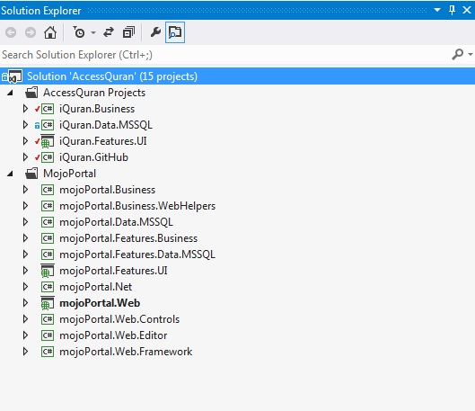

# iQuran

- For Arabic Readme reffer <a href="readme_Ar.md">HERE</a>  

- Advanced Quran Search Project - Access Quran -  This is a C# Project, prepared to be applied with <a href="http://MojoPortal.com" target="_blank"> Mojoportal</a> 

-To know how to use it with <a href="http://MojoPortal.com" target="_blank"> Mojoportal</a>, you can read this article <a href="https://www.mojoportal.com/developerdocs.aspx" target="_blank"> Developer Docs</a> 
-To know how to create your feature and Project you can find there <a href="https://www.mojoportal.com/setting-up-your-projects.aspx" target="_blank"> Setting Up Your Own Projects for Custom Development</a> 
- Also you can see this Image to see how the strucure of my Projects !   
  
- Or this Image to see the Folders structure I made : 
  

#Requirements 

- SQL Server 2008R2 - Microsoft SQL Server Management Studio	10.50.4033.0 or later
- Microsoft Visual Studio Proffessionals 2012
- .NET 4.5

#Credentials

This project actauly is <i>a convertion </i> of the MS Access Project structure and abilities made by Ahmed Bahgat <a href="http://free-islam.com" target="_blank">  Ahmed Bahgat </a> 
The original Program <a href="http://free-islam.com/modules.php?name=Forums&file=viewforum&f=31" target="_blank">  Access Quran Project </a> and
can be downloaded from <a href="http://free-islam.com/AccessQuran/Download/AQ1000.exe" target="_blank"> Click Here </a>  which is a desktop application with a comprehensive search utilities !

#How can you help?

- Contributing by translating the resources files to your native language -all except Arabic, English!
- Design a theme for the website after it is online!

#The target :

- <b>This is an Open source Project for Free!</b> 
- The web site will be - in sha'a allah - most powerfull search engine for quran with matematical values of Suras, Verses, Words and Letters, to calculate for your researches ,
also an advanced <b>tools</b> for searching the quran and translations! 
- Here you can search both Arabic Original Copy of Quran or any Translation we will incluse later, for now I just added one "English" Translation!  

The place of the initial web project will be at :  

<a href="http://www.iQuranAccess.com" target="_blank"> iQuranAccee.com </a> 
<a href="http://www.iQuranAccess.net" target="_blank"> iQuranAccee.net </a>
 

# Road Map :

<b> Part 1 - Quran Reading and Simple Search</b>

Features: 

1.1 - Ability to read Quran - Translation by Page.
1.2 - Simple Search Quran :
1.2.1 - Simple search within <b>Translations</b> From Sura from a verse to aSura to a Verse, for a specific word or part from word or Part from sentence Only!
1.2.2 - Simple Search Arabic Original Quran :
a. - Search for word by Root
b. - Search for Exact word.
c. - Search for a Part of word.
d. - Search for a part of sentence.
  
<b> Search Types :</b>
- Search From Sura to a Sura
- Search From Verse to a Verse
- Search by Dictional or Othmani Font draw

<b> Search Criterias :</b>
- Search Dictionaly with Alif types
- Search Dictionaly ignoring all Alif types

- Search Othmany full draw
- Search Othmany with Alif types
- Search Othmani ignoring all Alif types

- note : <b> Results always Othmani Draw</b>

1.3 - Ability to remember specific verses from within the search result, to collect them for later use
1.4 - Ability to share the verses by one click to almost about 281 social place!
1.5 - Ability to copy any Verse, just by mouse over it!

<b> Part 2 - User Personalization</b>

Features: 

2.1 - Activation of users subscriptions.
2.2 - Remebering Users settings and personalization.
2.3 - User personal - not public - notes on searches and verses!
2.4 - Activation Listening to Quran
whts else ahmad ?

<b> Part 3 - Advanced Search for Researchers</b>

Features: 

3.1 - Adding Multi Root results.
3.1 - Adding Multi Word Search.
3.2 - Adding all Access Quran SW Numeric features for Calculation Verses, Qords, Letters counts and repeatation "تكرار".

<b> Part 4 - Advanced Researchers & Calculations</b>

Features: 

3.1 - Activation all <b>NUMERIC</b> Quran Features with different levels:
3.1.1 - Dealing with Verses Counts.
3.1.2 - Dealing with Words Counts.
3.1.3 - Dealing with Letters Counts.
3.1.4 - Ability to remember and relate these calculations together.
3.1.5 - Ability to use the letters <b>Wheights</b> with these calcuations.

<b> Part Parallel - Mobile Application!

Features: 

- Parallel to all these steps, I will work on Mobile Application for this Project!

<b> Part Optional - Activation other modules!

Features: 

- Mojo Portal have many modules, like Forums, Blogs etc.. You can readjd <a href="https://www.mojoportal.com/features.aspx" target="_blank">HERE</a> the list of Mojo Portal features</b>
